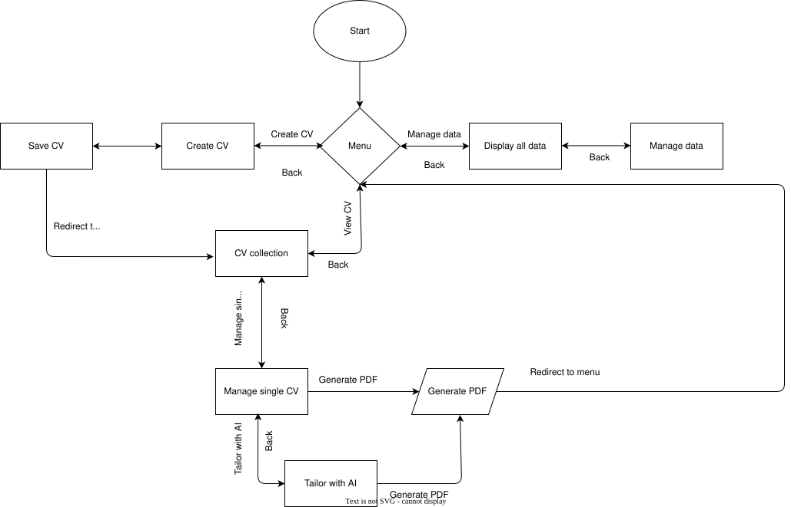

# LazyApply

A project that automates the creation of tailored PDF resumes based on collected data.

## 🛠 Built With (Technologies)

*   **Python** - Main application engine and core logic
*   **Flask** - Web framework used for routing, managing the application factory, and serving the interface
*   **SQLite** - Lightweight relational database for storing user profiles, skills, and resume data
*   **Jinja2** - Template engine for generating web views and dynamically injecting data into HTML resume templates
*   **WeasyPrint** - Advanced library for converting HTML and CSS into high-quality PDFs while preserving strict print dimensions (A4)
*   **HTML5 & CSS3** - Structure and styling for both the web interface and the resume templates
*   **Git & GitHub** - Version control and open-source repository hosting
*   **VS Code** - Main development environment

## File Directory
```text
LazyApply/
├── app/
│   ├── database/
│   ├── models/
│   ├── repositories/
│   ├── routes/
│   ├── services/
│   ├── static/
│       ├── css/
│       ├── icons/
│       └── imgs/
│   ├── templates/
│   └── __init__.py
├── instance/
├── venv/
├── .gitignore
├── architecture.drawio.svg
├── README.md
├── requirements.txt
└── run.py
```

## 🏗 System Architecture (Flowchart)


## 🚀 Getting Started

Follow these steps to set up the development environment and run the resume generator locally.

### 1. Clone the repository
```bash
git clone https://github.com/mariuszmalankiewicz97/LazyApply.git

cd LazyApply
```

### 2. Create and activate a virtual environment
It is strictly recommended to use a virtual environment to isolate project dependencies.
Windows:
```bash
python -m venv venv
.\venv\Scripts\activate
```
macOS / Linux:
```bash
python3 -m venv venv
source venv/bin/activate
```
### 3. Install dependencies
Once the virtual environment is active, install the required packages (including WeasyPrint and Jinja2):
```bash
pip install -r requirements.txt
```

### 4. Run the Generator
To generate your resume, simply run the main script:
```bash 
python run.py
```

### 🔍 Code Standards
To maintain high code quality, readability, and adherence to backend development best practices (e.g., SOLID principles), this project utilizes the following tools:

* **Black** - The uncompromising Python code formatter.
* **Flake8** - For linting and real-time error checking.
* **MVC** -(Model-View-Controller) is a pattern that divides an application into three parts: Model (data), View (presentation), and Controller (logic).
* **OOP** - Easier data management and hiding

If you are using **VS Code**, please ensure you have the official `Black Formatter` and `Flake8` extensions installed, and enable the `Format On Save` option in your editor settings before committing any new code.